# hacienda-engine SaaS Production Readiness Plan

> **Document Status**: Living document — update as milestones are achieved
> **Owner**: Platform Engineering
> **Last Updated**: 2026-08-25
> **Target**: Production SaaS deployment with GDPR/DORA/AI Act compliance

---

## Table of Contents

1. [Executive Summary](#1-executive-summary)
2. [Current Maturity Assessment](#2-current-maturity-assessment)
3. [Phased Roadmap](#3-phased-roadmap)
4. [Phase 0: Foundation (Weeks 1-2)](#4-phase-0-foundation)
5. [Phase 1: Horizontal Scaling (Weeks 3-4)](#5-phase-1-horizontal-scaling)
6. [Phase 2: Multi-Tenancy (Weeks 5-6)](#6-phase-2-multi-tenancy)
7. [Phase 3: Observability (Weeks 7-8)](#7-phase-3-observability)
8. [Phase 4: Security Hardening (Weeks 9-10)](#8-phase-4-security-hardening)
9. [Phase 5: Disaster Recovery (Weeks 11-12)](#9-phase-5-disaster-recovery)
10. [Phase 6: Developer Experience (Weeks 13-14)](#10-phase-6-developer-experience)
11. [Phase 7: Advanced SaaS Features (Weeks 15-18)](#11-phase-7-advanced-saas-features)
12. [Infrastructure as Code](#12-infrastructure-as-code)
13. [Configuration Management](#13-configuration-management)
14. [CI/CD Pipeline](#14-cicd-pipeline)
15. [Security & Compliance](#15-security--compliance)
16. [Operational Runbooks](#16-operational-runbooks)
17. [Success Metrics](#17-success-metrics)
18. [Budget](#18-budget)
19. [Risk Register](#19-risk-register)
20. [File Inventory](#20-file-inventory)

---

## 1. Executive Summary

**hacienda-engine** is a document intelligence platform providing extraction (97+ formats), PII detection/redaction, tamper-evident audit chains, human review queues, compliance report generation (DPIA, Model Card, DORA, AI Act, GDPR), RAG vector stores, and capability-based authentication — all in a single Rust workspace.

### Vision

Transform hacienda-engine from a self-hosted library into a **multi-tenant SaaS platform** that:

- Serves 100+ tenants with strict data isolation
- Processes 1M+ documents/month with sub-second latency
- Maintains 99.9% availability SLA
- Complies with GDPR, DORA, and AI Act out of the box
- Provides SDKs for 15+ programming languages

### Key Differentiators

| Feature | hacienda-engine | Competitors |
|---------|----------------|-------------|
| **Regulatory Compliance** | Built-in DPIA, Model Card, DORA, AI Act | Bolt-on or manual |
| **Pseudonymization** | AES-256-SIV, key-rotatable, reversible | Static masking |
| **Audit Chain** | Tamper-evident (blake3), immutable | Append-only logs |
| **PII Detection** | Regex + GLiNER2 + LoRA adapters | Rule-based only |
| **Format Coverage** | 97+ formats (xberg) | 20-30 formats |

---

## 2. Current Maturity Assessment

### Scorecard

| Dimension | Score | Status | Notes |
|-----------|-------|--------|-------|
| **Core Functionality** | 9/10 | ✅ Production-ready | Extraction, PII, redaction, audit, compliance, RAG |
| **API Completeness** | 8/10 | ⚠️ Near-ready | 44 ops, OpenAPI 3.1; missing rate limiting |
| **Container/Deploy** | 7/10 | ⚠️ Needs work | Docker validated; no K8s manifests |
| **Observability** | 6/10 | ⚠️ Needs work | Prometheus/Grafana; no distributed tracing |
| **Security** | 7/10 | ⚠️ Needs hardening | Argon2id keys; no secrets rotation |
| **Multi-tenancy** | 4/10 | ❌ Incomplete | TenantCtx exists; API enforcement partial |
| **Scalability** | 3/10 | ❌ Not started | Single-replica design |
| **Disaster Recovery** | 2/10 | ❌ Not started | Audit export; no backup automation |
| **Compliance Evidence** | 8/10 | ✅ Near-ready | Generators built-in; attestation pack needed |
| **SDK/DX** | 6/10 | ⚠️ Needs work | Python/TS SDKs; FFI bindings not started |

### Critical Gaps (Must-Fix Before Production)

1. **No Horizontal Scaling** — Single-replica architecture cannot handle production load
2. **No Data Isolation** — Multi-tenant RLS not enforced at API layer
3. **No Secrets Management** — Hardcoded tokens in config files
4. **No Automated Backups** — Manual audit export only
5. **No Rate Limiting** — DDoS and abuse possible

---

## 3. Phased Roadmap

### Timeline

```
Week  1-2   3-4   5-6   7-8   9-10  11-12  13-14  15-18
      |-----|-----|-----|-----|------|------|------|
Phase 0: Foundation ████
Phase 1: Scaling        ████
Phase 2: Multi-Tenancy       ████
Phase 3: Observability            ████
Phase 4: Security                      ████
Phase 5: DR                                  ████
Phase 6: DX                                       ████
Phase 7: SaaS Features                                  ████
```

### Dependencies

```
Phase 0 (Foundation)
    ├── Phase 1 (Scaling)
    │       ├── Phase 2 (Multi-Tenancy)
    │       └── Phase 3 (Observability)
    ├── Phase 4 (Security)
    └── Phase 5 (DR)

Phase 6 (DX) — can start in parallel with Phases 3-5
Phase 7 (SaaS Features) — requires Phases 1-5 complete
```---

## 4. Phase 0: Foundation

> **Goal**: Establish production infrastructure prerequisites
> **Duration**: Weeks 1-2
> **Team**: 2 Platform Engineers + 1 Backend Engineer

### Tasks

| ID | Task | Owner | Acceptance Criteria |
|----|------|-------|---------------------|
| F0.1 | Secrets Management Integration | Platform | External Secrets Operator + Vault; production.toml templated; pseudonym keys injected at runtime |
| F0.2 | Postgres Provisioning (Managed) | Platform | Cloud SQL / RDS instance; DATABASE_URL secret; migrations run on deploy |
| F0.3 | S3-Compatible Object Store | Platform | MinIO (dev) / S3 (prod); bucket policies; presigned upload config |
| F0.4 | Container Registry & Image Promotion | Platform | GHCR with cosign signing; SBOM (Syft) + provenance (SLSA) |
| F0.5 | Kubernetes Baseline Cluster | Platform | GKE/EKS/AKS; CNI, CSI, cert-manager, external-dns |
| F0.6 | GitOps Deployment (ArgoCD/Flux) | Platform | Kustomize manifests in deploy/; auto-sync on tag |
| F0.7 | TLS Termination & Ingress | Platform | cert-manager + Let's Encrypt; HSTS, CSP headers |

### Gate Criteria

```bash
# All must pass before proceeding to Phase 1
✅ Vault unsealed and accessible
✅ Postgres migrations successful
✅ S3 bucket accessible from cluster
✅ K8s cluster healthy (3 nodes, all ready)
✅ ArgoCD application synced
✅ TLS certificate valid
✅ Smoke test: curl https://hacienda.example.com/health
```

---

## 5. Phase 1: Horizontal Scaling

> **Goal**: Stateless API with horizontal scaling capability
> **Duration**: Weeks 3-4
> **Team**: 2 Backend Engineers
> **Prerequisites**: Phase 0 complete

### Tasks

| ID | Task | Owner | Acceptance Criteria |
|----|------|-------|---------------------|
| S1.1 | Stateless API Verification | Backend | Multiple replicas; no local file state; audit/rag use Postgres/S3 |
| S1.2 | Postgres Audit Store | Backend | PostgresAuditStore enabled; FileAuditStore deprecated for prod |
| S1.3 | Postgres Review Queue | Backend | PostgresReviewQueue enabled; concurrent assignment safe |
| S1.4 | PgVector RAG Backend | Backend | pgvector production-hardened; HNSW index tuned |
| S1.5 | Redis for Caching/Rate Limiting | Platform | Managed Redis; session cache, rate limit counters |
| S1.6 | Horizontal Pod Autoscaler | Platform | HPA on CPU (70%), memory (80%); min 3, max 20 |
| S1.7 | Graceful Shutdown & Drain | Backend | SIGTERM → drain connections; preStop hook 30s |

### Target Architecture

```
┌─────────────────────────────────────────────────────────────────┐
│                    Kubernetes Cluster                            │
│  ┌───────────────────────────────────────────────────────────┐  │
│  │                   Ingress Controller                       │  │
│  │              (TLS termination, rate limiting)              │  │
│  └───────────────────────────────────────────────────────────┘  │
│                              │                                   │
│  ┌───────────────────────────────────────────────────────────┐  │
│  │                   hacienda-api (HPA: 3-20)                 │  │
│  │              ┌─────┐ ┌─────┐ ┌─────┐ ┌─────┐             │  │
│  │              │Pod 1│ │Pod 2│ │Pod 3│ │Pod N│             │  │
│  │              └─────┘ └─────┘ └─────┘ └─────┘             │  │
│  └───────────────────────────────────────────────────────────┘  │
│          │              │              │              │           │
│  ┌──────────────┐ ┌──────────┐ ┌──────────────┐ ┌──────────┐  │
│  │ Postgres (HA)│ │  Redis   │ │   S3 / GCS   │ │  Vault   │  │
│  │  Primary +   │ │ (cluster)│ │  (CRR enabled)│ │ (unseal) │  │
│  │  Replica     │ │          │ │              │ │          │  │
│  └──────────────┘ └──────────┘ └──────────────┘ └──────────┘  │
└─────────────────────────────────────────────────────────────────┘
```

---

## 6. Phase 2: Multi-Tenancy

> **Goal**: Complete data isolation between tenants
> **Duration**: Weeks 5-6
> **Team**: 2 Backend Engineers
> **Prerequisites**: Phase 1 complete

### Tasks

| ID | Task | Owner | Acceptance Criteria |
|----|------|-------|---------------------|
| T2.1 | Tenant Resolution Middleware | Backend | Extract TenantId from JWT; inject into AuthContext |
| T2.2 | Row-Level Security (RLS) | Backend | tenant_id on all tables; CREATE POLICY per table |
| T2.3 | S3 Prefix Isolation | Backend | Keys prefixed tenants/{tenant_id}/; IAM policies enforce |
| T2.4 | Audit Chain Segmentation | Backend | Per-tenant + per-node segmentation; cross-tenant blocked |
| T2.5 | Quota Enforcement | Backend | Monthly entity/byte limits; Redis counters; 429 on exceeded |
| T2.6 | Tenant Onboarding API | Backend | POST /v1/auth/tenants (admin); provisions all resources |

### Data Isolation Model

```
Tenant A                    Tenant B                    Tenant C
┌─────────────┐            ┌─────────────┐            ┌─────────────┐
│ Schema:     │            │ Schema:     │            │ Schema:     │
│ tenants/    │            │ tenants/    │            │ tenants/    │
│   tenant_a/ │            │   tenant_b/ │            │   tenant_c/ │
└─────────────┘            └─────────────┘            └─────────────┘
       │                          │                          │
       ▼                          ▼                          ▼
┌─────────────┐            ┌─────────────┐            ┌─────────────┐
│ Postgres    │            │ Postgres    │            │ Postgres    │
│ RLS Policy: │            │ RLS Policy: │            │ RLS Policy: │
│ WHERE       │            │ WHERE       │            │ WHERE       │
│ tenant_id=A │            │ tenant_id=B │            │ tenant_id=C │
└─────────────┘            └─────────────┘            └─────────────┘
       │                          │                          │
       ▼                          ▼                          ▼
┌─────────────┐            ┌─────────────┐            ┌─────────────┐
│ S3 Bucket   │            │ S3 Bucket   │            │ S3 Bucket   │
│ Prefix:     │            │ Prefix:     │            │ Prefix:     │
│ tenants/A/  │            │ tenants/B/  │            │ tenants/C/  │
└─────────────┘            └─────────────┘            └─────────────┘
```

---

## 7. Phase 3: Observability

> **Goal**: Full visibility into system health and performance
> **Duration**: Weeks 7-8
> **Team**: 1 Platform Engineer + 1 Backend Engineer
> **Prerequisites**: Phase 1 complete

### Tasks

| ID | Task | Owner | Acceptance Criteria |
|----|------|-------|---------------------|
| O3.1 | Distributed Tracing (OTel) | Platform | opentelemetry crate; Jaeger/Tempo backend; 100% sampled errors |
| O3.2 | Structured Logging (JSON) | Backend | tracing-subscriber JSON; trace_id/tenant_id fields |
| O3.3 | SLO/SLI Dashboards | Platform | Grafana: Latency, Error Rate, Availability, Throughput |
| O3.4 | Alerting Rules | Platform | PrometheusRule → PagerDuty/Slack; severity routing |
| O3.5 | Health/Readiness Probes | Backend | /health (liveness), /ready (readiness checks) |
| O3.6 | Chaos Engineering Baseline | Platform | Pod kill, network partition, DB failover tests |
| O3.7 | Capacity Planning Model | Platform | Document: requests/pod, DB connections, growth projections |

### Observability Stack

```
┌─────────────────────────────────────────────────────────────────┐
│                    Observability Pipeline                         │
│                                                                  │
│  hacienda-api ──traces──▶ Jaeger/Tempo                          │
│       │                                                           │
│       ├──logs──▶ Loki ──▶ Grafana Dashboards                    │
│       │                                                           │
│       └──metrics──▶ Prometheus ──▶ Alertmanager ──▶ PagerDuty   │
│                                                    Slack         │
│                                                    Email         │
└─────────────────────────────────────────────────────────────────┘
```

---

## 8. Phase 4: Security Hardening

> **Goal**: Production-grade security posture
> **Duration**: Weeks 9-10
> **Team**: 1 Security Engineer + 1 Backend Engineer
> **Prerequisites**: Phase 1 complete

### Tasks

| ID | Task | Owner | Acceptance Criteria |
|----|------|-------|---------------------|
| C4.1 | Secrets Rotation Automation | Platform | ExternalSecret refresh; quarterly key rotation drill |
| C4.2 | API Rate Limiting | Backend | Token bucket per principal (Redis); configurable tiers |
| C4.3 | Input Validation & Sanitization | Backend | Zod schemas; MIME validation; size limits; zip bomb protection |
| C4.4 | Dependency Scanning | Platform | cargo-audit + cargo-deny; Syft SBOM; Grype scan |
| C4.5 | Penetration Test (3rd Party) | Security | OWASP Top 10; remediation SLA: Critical 7d, High 30d |
| C4.6 | Compliance Attestation Pack | Compliance | SOC2, ISO 27001, GDPR DPIA, AI Act conformity |

### Security Controls Matrix

| Control | Layer | Implementation | Verification |
|---------|-------|----------------|--------------|
| Authentication | API | Argon2id API keys | CI: key hash tests |
| Authorization | API | Capability-based (deny-by-default) | Integration: cross-capability access denied |
| Encryption at Rest | Storage | AES-256 (S3 SSE-KMS, Postgres TDE) | Infra audit |
| Encryption in Transit | Network | TLS 1.3 (cert-manager) | TLS scan |
| Input Validation | API | Zod schemas, MIME validation | Fuzz testing |
| Rate Limiting | API | Redis token bucket | Load testing |
| Audit Logging | Core | Blake3 hash chain | hacienda audit verify |
| Data Isolation | Multi-tenant | RLS + prefix isolation | Pen test |

---

## 9. Phase 5: Disaster Recovery

> **Goal**: Automated backup/restore with tested RTO/RPO
> **Duration**: Weeks 11-12
> **Team**: 1 Platform Engineer + 1 Backend Engineer
> **Prerequisites**: Phases 1-2 complete

### Tasks

| ID | Task | Owner | Acceptance Criteria |
|----|------|-------|---------------------|
| D5.1 | RTO/RPO Definition | Platform + Product | RTO < 4h, RPO < 1h (audit), RPO < 5min (Postgres) |
| D5.2 | Automated Postgres Backup | Platform | PITR; daily base + WAL; cross-region replica |
| D5.3 | S3 Cross-Region Replication | Platform | CRR enabled; versioning; lifecycle policies |
| D5.4 | Audit Chain Backup | Backend | Daily hacienda audit export to S3; integrity check |
| D5.5 | Runbook Documentation | Platform | Failover, restore, key rotation, incident response |
| D5.6 | DR Drill (Quarterly) | Platform | Simulated region loss; measure actual RTO/RPO |

### Backup Strategy

```
┌─────────────────────────────────────────────────────────────────┐
│                    Backup & Restore                              │
│                                                                  │
│  Postgres                                                        │
│  ├── Continuous WAL archiving to S3                             │
│  ├── Daily base backup (pg_dump + WAL)                         │
│  ├── Cross-region replica (async)                              │
│  └── Restore test: weekly automated                            │
│                                                                  │
│  S3 Objects                                                     │
│  ├── CRR to secondary region                                   │
│  ├── Versioning enabled                                        │
│  ├── Lifecycle: delete markers → 90d, versions → 365d          │
│  └── Restore test: monthly manual                              │
│                                                                  │
│  Audit Chain                                                    │
│  ├── Daily hacienda audit export to S3                         │
│  ├── Hash chain integrity verification (CI)                    │
│  └── Restore test: quarterly drill                             │
└─────────────────────────────────────────────────────────────────┘
```

---

## 10. Phase 6: Developer Experience

> **Goal**: Complete SDK coverage and developer tooling
> **Duration**: Weeks 13-14
> **Team**: 2 Backend Engineers
> **Prerequisites**: Can run in parallel with Phases 3-5

### Tasks

| ID | Task | Owner | Acceptance Criteria |
|----|------|-------|---------------------|
| X6.1 | API Versioning Policy | Backend | URL versioning (/v1/); Sunset header; 12-month support |
| X6.2 | Native FFI Bindings (15 langs) | Backend | alef.toml source files; CI builds/tests all targets |
| X6.3 | SDK Publishing Automation | Platform | Trusted publishing (PyPI/npm); version sync |
| X6.4 | Interactive API Docs | Backend | Swagger UI at /docs; auth demo; code samples |
| X6.5 | CLI Distribution | Platform | cargo install; Homebrew tap; GHCR binary releases |
| X6.6 | Integration Test Suite | Backend | Testcontainers for PG/S3/Redis; E2E scenarios |

### SDK Coverage Matrix

| Language | Package | Status | Generation |
|----------|---------|--------|------------|
| Python | hacienda-sdk (PyPI) | Generated | OpenAPI |
| TypeScript | @hacienda-engine/sdk (npm) | Generated | OpenAPI |
| Rust | hacienda (crates.io) | Native | Direct |
| Go | hacienda-go | Planned | alef |
| Ruby | hacienda-ruby | Planned | alef |
| PHP | hacienda-php | Planned | alef |
| Java | hacienda-java | Planned | alef |
| C# | hacienda-dotnet | Planned | alef |
| Elixir | hacienda-elixir | Planned | alef |
| Dart | hacienda-dart | Planned | alef |
| Kotlin/Android | hacienda-kotlin | Planned | alef |
| Swift | hacienda-swift | Planned | alef |
| Zig | hacienda-zig | Planned | alef |
| C FFI | hacienda-ffi | Planned | alef |
| JNI | hacienda-jni | Planned | alef |

---

## 11. Phase 7: Advanced SaaS Features

> **Goal**: Differentiated SaaS capabilities
> **Duration**: Weeks 15-18
> **Team**: 2 Backend Engineers + 1 Frontend Engineer
> **Prerequisites**: Phases 1-5 complete

### Tasks

| ID | Task | Owner | Acceptance Criteria |
|----|------|-------|---------------------|
| A7.1 | Usage-Based Billing Integration | Product + Backend | Metering → Stripe/Metronome; per-tenant invoices |
| A7.2 | Customer Portal (Self-Service) | Frontend | React: API keys, usage, audit downloads, compliance reports |
| A7.3 | Webhook System | Backend | POST /v1/webhooks; retry; dead letter queue; HMAC signatures |
| A7.4 | Async Job Priority & Scheduling | Backend | Priority queues (Redis Streams); cron; job chaining |
| A7.5 | Custom Model/Plugin Marketplace | Product | Plugin registry; WASM sandbox; security review |
| A7.6 | Multi-Region Active-Active | Platform | Global LB; GeoDNS; audit chain conflict resolution |

### Revenue Model

```
┌─────────────────────────────────────────────────────────────────┐
│                    Pricing Tiers                                 │
│                                                                  │
│  Starter ($99/mo)                                               │
│  ├── 10,000 documents/month                                    │
│  ├── 1 tenant                                                   │
│  ├── 3 API keys                                                 │
│  └── Community support                                          │
│                                                                  │
│  Professional ($499/mo)                                         │
│  ├── 100,000 documents/month                                   │
│  ├── 5 tenants                                                  │
│  ├── Unlimited API keys                                         │
│  └── Email support (24h SLA)                                   │
│                                                                  │
│  Enterprise (Custom)                                            │
│  ├── Unlimited documents                                        │
│  ├── Unlimited tenants                                          │
│  ├── Dedicated support                                          │
│  ├── SLA guarantee                                              │
│  └── On-premise option                                         │
└─────────────────────────────────────────────────────────────────┘
```

---

## 12. Infrastructure as Code

### Kubernetes Manifests Structure

```
deploy/
├── base/
│   ├── namespace.yaml
│   ├── deployment.yaml          # hacienda-api (HPA, probes)
│   ├── service.yaml
│   ├── ingress.yaml             # TLS, annotations
│   ├── configmap.yaml           # non-secret config
│   ├── secret.yaml              # ExternalSecret refs
│   ├── servicemonitor.yaml      # Prometheus scrape
│   ├── poddisruptionbudget.yaml # minAvailable: 2
│   └── networkpolicy.yaml       # deny-by-default
├── overlays/
│   ├── staging/
│   │   ├── kustomization.yaml
│   │   ├── replica-count.yaml   # min 2
│   │   └── resources.yaml       # lower limits
│   └── production/
│       ├── kustomization.yaml
│       ├── replica-count.yaml   # min 3, max 20
│       ├── resources.yaml       # 2CPU/4GB
│       └── podantiaffinity.yaml # spread across zones
├── monitoring/
│   ├── prometheus-rules.yaml
│   ├── grafana-dashboards.yaml
│   └── servicemonitors.yaml
└── dependencies/
    ├── postgresql.yaml
    ├── redis.yaml
    └── minio.yaml
```

---

## 13. Configuration Management

### Production Config Template

```toml
[extraction]
output_format = "json"

[pii]
enabled = true
redaction_profile = "GDPR"
model = { enabled = true, model_id = "fastino/GLiNER2-Guardrails-PII-Multi" }
threshold = 0.7

[redaction]
default_mode = "pseudonymize"

[compliance]
enabled = true
model_name = "hacienda-pii-v1"
enabled_reports = ["DPIA", "ModelCard", "DORA", "AIAct", "Checklist"]

[audit]
enabled = true
backend = "postgres"
segment_max_entries = 10000

[review]
enabled = true
deadline_hours = 24

[glossary]
enabled = true
min_confidence = 0.5

[auth]
enabled = true
resolver = "api_keys"

[jobs]
enabled = true
worker_count = 4

[rag]
enabled = true
backend = "pgvector"
embedding_dim = 384

[uploads]
enabled = true
backend = "s3"
max_file_size_bytes = 1073741824  # 1GB
```

### Environment Matrix

| Environment | Replicas | Resources | Log Level | Stores |
|-------------|----------|-----------|-----------|--------|
| Development | 1 | 0.5CPU/1GB | debug | File-backed |
| Staging | 2 | 1CPU/2GB | info | PG/S3/Redis |
| Production | 3-20 | 2CPU/4GB | info | PG/S3/Redis/Vault |

---

## 14. CI/CD Pipeline

### Release Process

```mermaid
graph LR
    A[Push tag vX.Y.Z] --> B[CI: All workflows pass]
    B --> C[GitHub Release created]
    C --> D[Docker image built, signed, pushed]
    D --> E[SBOM + Provenance attached]
    E --> F[Crate published to crates.io]
    F --> G[SDKs published to PyPI/npm]
    G --> H[ArgoCD detects new tag]
    H --> I[Staging auto-deploy]
    I --> J[Smoke tests pass]
    J --> K[Manual promotion]
    K --> L[Production deploy]
    L --> M[Canary analysis]
```



---

## 15. Security & Compliance

### Data Flow & Controls

| Data Type | At Rest | In Transit | Retention | Access |
|-----------|---------|------------|-----------|--------|
| Documents (raw) | S3 SSE-KMS | TLS 1.3 | Per tenant | Presigned URL |
| Extracted Text | Postgres TDE | TLS 1.3 | Per tenant | Tenant RLS |
| PII Spans | Postgres TDE | TLS 1.3 | Immutable | AuditRead |
| Pseudonym Keys | Vault/KMS | N/A | Quarterly rotation | PiiReveal |
| Audit Chain | Postgres + S3 | TLS 1.3 | 7 years | AuditRead |

### Compliance Coverage

| Regulation | Artifact | Generator | Frequency |
|------------|----------|-----------|-----------|
| GDPR | DPIA | hacienda compliance dpia | Per processing activity |
| GDPR | ROPA | Audit chain export | Continuous |
| AI Act | Model Card | hacienda compliance model-card | Per model version |
| AI Act | Conformity Assessment | hacienda compliance checklist | Pre-deployment |
| DORA | Incident Report | hacienda compliance dora | Per incident |
| SOC2 | Evidence Pack | Audit chain + configs | Annual |

---

## 16. Operational Runbooks

| Runbook | Trigger | RTO Target |
|---------|---------|------------|
| api-down.md | /health failing | 15 min |
| db-failover.md | PG primary unreachable | 5 min (auto) |
| s3-outage.md | Upload/download failing | 30 min |
| pseudonym-key-compromise.md | Key material exposed | 1 hour |
| audit-chain-corruption.md | Verify fails | 4 hours |
| tenant-data-deletion.md | GDPR Art. 17 request | 30 days |
| capacity-exhaustion.md | HPA at max | 15 min |
| dependency-outage.md | Upstream unavailable | 30 min |

---

## 17. Success Metrics

### SLIs/SLOs

| SLI | SLO Target | Alert Threshold |
|-----|------------|-----------------|
| Availability | 99.9% | < 99.95% (burn rate) |
| Latency (p95) | < 500ms | > 1s for 5m |
| Latency (p99) | < 2s | > 5s for 5m |
| Error Rate | < 0.1% | > 1% for 5m |

### Business KPIs

| KPI | Target |
|-----|--------|
| Active Tenants | > 50 |
| Documents Processed/Day | > 100k |
| PII Detection Recall | > 99.5% |
| PII Detection Precision | > 95% |
| MTTR | < 30 min |

---

## 18. Budget & Resources

### Infrastructure (Monthly, ~100 tenants)

| Component | Estimate |
|-----------|----------|
| Kubernetes (GKE/EKS) | $2,500 |
| Cloud SQL (Postgres) | $800 |
| Redis (Memorystore) | $300 |
| Object Storage (S3) | $200 |
| Load Balancer + CDN | $150 |
| Monitoring | $500 |
| Secrets (Vault) | $100 |
| Container Registry | $50 |
| CI/CD (GitHub Actions) | $200 |
| **TOTAL** | **~$4,800/mo** |

### Engineering Investment

| Phase | Weeks | FTE |
|-------|-------|-----|
| Phase 0 | 2 | 3 |
| Phase 1 | 2 | 2 |
| Phase 2 | 2 | 2 |
| Phase 3 | 2 | 2 |
| Phase 4 | 2 | 2 |
| Phase 5 | 2 | 2 |
| Phase 6 | 2 | 2 |
| Phase 7 | 4 | 3 |
| **TOTAL** | **18** | **~2.5 avg** |

---

## 19. Risk Register

| Risk | Likelihood | Impact | Mitigation |
|------|------------|--------|------------|
| xberg upstream breaks | Medium | High | Vendor patches; pin commit; monitor releases |
| Postgres write bottleneck | Medium | High | Benchmark; batch writes; async sink |
| Pseudonym key loss | Low | Critical | HSM-backed Vault; quarterly rotation drill |
| Multi-tenant data leak | Low | Critical | RLS + tests; pen test; code review |
| Regulatory change | Medium | High | Modular generators; track EU AI Act |

---

## 20. File Inventory

### New Files to Create

```
deploy/
├── base/*.yaml
├── overlays/{staging,production}/*.yaml
├── monitoring/*.yaml
└── dependencies/*.yaml

.github/workflows/
├── ci-k8s.yaml
├── ci-security.yaml
├── ci-load.yaml
├── ci-contract.yaml

runbooks/*.md

hacienda-api/src/middleware/{tenant,rate_limit,tracing}.rs
hacienda-api/src/handlers/{webhooks,tenants}.rs

docs/saas-production/runbooks/*.md
docs/saas-production/specs/*.md
```

---

## Sign-Off

| Role | Name | Date |
|------|------|------|
| Tech Lead (Backend) | | |
| Tech Lead (Platform) | | |
| Security Lead | | |
| Compliance Lead | | |
| Product Owner | | |

---

*This plan is a living document. Update status monthly. Review with stakeholders quarterly.*