# Deployment Specification

## Environments

| Environment | Purpose | URL | Replicas | Data |
|-------------|---------|-----|----------|------|
| **Development** | Local dev | localhost:8787 | 1 | File-backed |
| **Staging** | Integration testing | hacienda-staging.example.com | 2 | Shared PG/S3 |
| **Production** | Live traffic | hacienda.example.com | 3-20 (HPA) | Dedicated PG/S3/Redis |

## Deployment Pipeline

```mermaid
graph LR
    A[Push tag vX.Y.Z] --> B[CI: All workflows pass]
    B --> C[GitHub Release created]
    C --> D[Docker image built, signed, pushed]
    D --> E[SBOM + Provenance attached]
    E --> F[Crate published to crates.io]
    F --> G[SDKs published to PyPI/npm]
    G --> H[ArgoCD detects new tag]
    H --> I[Staging auto-deploy]
    I --> J[Smoke tests pass]
    J --> K[Manual promotion]
    K --> L[Production deploy]
    L --> M[Canary analysis 10%→100%]
```



## Image Promotion

```bash
# 1. Tag triggers build
# 2. Multi-arch build (amd64/arm64)
docker buildx build --platform linux/amd64,linux/arm64 \
  -f docker/Dockerfile \
  -t ghcr.io/jamon8888/hacienda:vX.Y.Z \
  --push .

# 3. Cosign sign
cosign sign --yes ghcr.io/jamon8888/hacienda@vX.Y.Z

# 4. ArgoCD detects via image updater
# 5. Staging auto-sync
# 6. Manual promotion to production
```

## Rollback Procedure

```bash
# 1. Quick rollback (ArgoCD)
argocd app rollback hacienda-prod <previous-revision>

# 2. Or revert Git tag
git tag -d vX.Y.Z
git push origin :refs/tags/vX.Y.Z
# ArgoCD will sync to previous tag

# 3. Emergency: scale to 0, fix, redeploy
kubectl scale deployment hacienda-api -n hacienda-prod --replicas=0
# Fix issue
kubectl scale deployment hacienda-api -n hacienda-prod --replicas=3
```

## Canary Analysis

```yaml
# Argo Rollouts AnalysisTemplate
apiVersion: argoproj.io/v1alpha1
kind: AnalysisTemplate
metadata:
  name: hacienda-canary
spec:
  args:
    - name: service-name
  metrics:
    - name: success-rate
      interval: 1m
      successCondition: result[0] >= 0.999
      provider:
        prometheus:
          address: http://prometheus.monitoring:9090
          query: |
            sum(rate(http_requests_total{job="hacienda-api",status=~"2.."}[5m])) /
            sum(rate(http_requests_total{job="hacienda-api"}[5m]))
    - name: latency-p95
      interval: 1m
      successCondition: result[0] <= 1
      provider:
        prometheus:
          address: http://prometheus.monitoring:9090
          query: |
            histogram_quantile(0.95, sum(rate(http_request_duration_seconds_bucket{job="hacienda-api"}[5m])) by (le))
```

## Configuration Management

```bash
# Non-secret config: ConfigMap (GitOps)
# Secrets: ExternalSecrets → Vault
# Feature flags: ConfigMap + runtime reload

# Reload config without restart
kubectl rollout restart deployment/hacienda-api -n hacienda-prod
```

## Database Migrations

```bash
# Automatic on deploy (initContainer)
initContainers:
  - name: migrate
    image: ghcr.io/jamon8888/hacienda:vX.Y.Z
    command: ["hacienda", "migrate", "up"]
    envFrom:
      - secretRef:
          name: hacienda-secrets

# Manual if needed
kubectl run -n hacienda-prod --rm -i migrate --image=ghcr.io/jamon8888/hacienda:vX.Y.Z -- hacienda migrate up
```

## Health Checks

```bash
# Liveness: /health - process alive
# Readiness: /ready - dependencies reachable
# Startup: /health - long initialization

# Probe configuration
livenessProbe:
  httpGet:
    path: /health
    port: 8787
  initialDelaySeconds: 10
  periodSeconds: 10

readinessProbe:
  httpGet:
    path: /ready
    port: 8787
  initialDelaySeconds: 5
  periodSeconds: 5
```

## Resource Management

```yaml
resources:
  requests:
    cpu: "2000m"
    memory: "4Gi"
  limits:
    cpu: "4000m"
    memory: "8Gi"

# QoS: Guaranteed (requests == limits for production)
```

## Security Context

```yaml
securityContext:
  runAsNonRoot: true
  runAsUser: 65532
  runAsGroup: 65532
  fsGroup: 65532
  seccompProfile:
    type: RuntimeDefault
  capabilities:
    drop: ["ALL"]
  readOnlyRootFilesystem: true
```

## Network Policies

```yaml
# Ingress: only from ingress-nginx and monitoring
# Egress: only to PostgreSQL, Redis, S3, monitoring, DNS
# Default deny all
```

## Pod Disruption Budget

```yaml
minAvailable: 2
```

## Monitoring Integration

```yaml
# ServiceMonitor for Prometheus
# Grafana dashboards auto-provisioned
# Alert rules deployed via PrometheusRule
```
