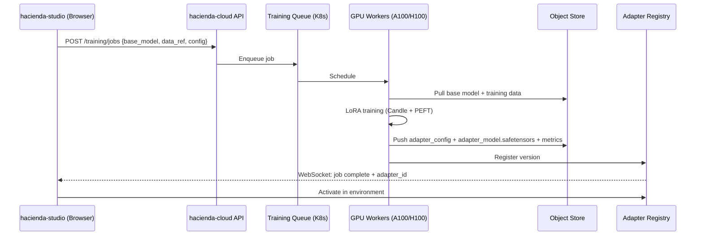

# Strategic Plan: Client-Trained LoRA Ecosystem Across All Surfaces

**Status:** Strategic Vision — Foundation exists, deep integration needed  
**Priority:** Differentiable Moat (v0.3.0+)  
**Codebases:** hacienda-engine (server) + Hacienda-mind (MCP/CLI) + hacienda-studio (WASM)

---

## 🎯 Executive Summary

**Current Reality:**
- ✅ `xberg-gliner` Candle backend: Full PEFT LoRA load + merge-at-load (`load_adapter`/`unload_adapter`)
- ✅ `Hacienda-mind`: `pii-candle` crate with single LoRA at startup (`lora_adapter_dir` config)
- ✅ `hacienda-engine`: Option A plan (multi-adapter cache) ready to implement
- ❌ **No unified LoRA management across API, CLI, MCP, Studio**
- ❌ **No client LoRA training pipeline** (the moat)

**Vision:** **hacienda becomes the "LoRA OS" for private PII/Vertical NER** — clients train adapters in Studio SaaS, deploy instantly to API/CLI/MCP/Edge via unified registry, hot-swap at runtime.

---

## 🏗️ Current Architecture Gap Analysis

### hacienda-engine (Server/API)
| Surface | LoRA Support | Gap |
|---------|--------------|-----|
| REST API (`/v1/pii/*`) | Planned (Option A) | No adapter registry, no training |
| CLI (`hacienda pii *`) | Planned | No `train`/`push`/`pull` commands |
| xberg-native facade | Planned | Single import, but no registry client |

### Hacienda-mind (MCP/CLI/Embedded)
| Surface | LoRA Support | Gap |
|---------|--------------|-----|
| MCP Tools (`pii_*`) | Single adapter at startup (`lora_adapter_dir`) | No runtime swap, no registry |
| CLI (`hacienda-mcp`) | None | No PII commands exposed |
| Embedded (library) | `pii_candle::Gliner2Candle` direct | No multi-adapter, no remote fetch |

### hacienda-studio (WASM/Browser)
| Surface | LoRA Support | Gap |
|---------|--------------|-----|
| WASM PII | ❌ Candle LoRA gated by `#[cfg(not(wasm32))]` | Need in-memory adapter loading (Option B Phase 2) |
| UI | None | No adapter management, no training UI |

---

## 🔑 Core Abstraction: `LoRARegistry` (New Crate)

**Location:** `hacienda-engine/hacienda-core/src/pii/lora_registry.rs` (new)  
**Shared:** Both `hacienda-engine` and `Hacienda-mind` depend on it

```rust
// hacienda-core/src/pii/lora_registry.rs

use std::collections::HashMap;
use std::path::PathBuf;
use std::sync::Arc;
use xberg::text::ner::candle::CandleBackend;
use serde::{Deserialize, Serialize};

/// Unique identifier for a LoRA adapter (namespaced by tenant)
#[derive(Debug, Clone, PartialEq, Eq, Hash, Serialize, Deserialize)]
pub struct AdapterId {
    pub tenant: String,      // "acme-corp", "hacienda-cloud"
    pub name: String,        // "pii-finance-v2", "legal-contracts"
    pub version: String,     // "v1.2.3" or git sha
}

impl AdapterId {
    pub fn new(tenant: impl Into<String>, name: impl Into<String>, version: impl Into<String>) -> Self {
        Self { tenant: tenant.into(), name: name.into(), version: version.into() }
    }
    pub fn key(&self) -> String {
        format!("{}/{}:{}", self.tenant, self.name, self.version)
    }
}

/// Metadata for a registered adapter
#[derive(Debug, Clone, Serialize, Deserialize)]
pub struct AdapterMetadata {
    pub id: AdapterId,
    pub display_name: String,
    pub description: String,
    pub categories: Vec<String>,           // ["credit_card", "iban", ...]
    pub base_model: String,                // "gliner2-pii-base-v1"
    pub size_bytes: u64,
    pub created_at: chrono::DateTime<chrono::Utc>,
    pub training_config: Option<TrainingConfig>,  // For reproducibility
    pub metrics: Option<AdapterMetrics>,          // F1, precision, recall per category
    pub source: AdapterSource,
}

#[derive(Debug, Clone, Serialize, Deserialize)]
pub enum AdapterSource {
    Local { path: PathBuf },
    Remote { url: String, sha256: String },  // CDN / object store
    Registry { registry_url: String },       // hacienda-cloud registry
}

#[derive(Debug, Clone, Serialize, Deserialize)]
pub struct TrainingConfig {
    pub base_model: String,
    pub rank: usize,
    pub alpha: f32,
    pub target_modules: Vec<String>,
    pub epochs: usize,
    pub learning_rate: f32,
    pub train_samples: usize,
    pub eval_f1: Option<f32>,
}

#[derive(Debug, Clone, Serialize, Deserialize)]
pub struct AdapterMetrics {
    pub overall_f1: f32,
    pub per_category: HashMap<String, CategoryMetrics>,
    pub latency_ms_p50: u64,
    pub latency_ms_p99: u64,
}

#[derive(Debug, Clone, Serialize, Deserialize)]
pub struct CategoryMetrics {
    pub precision: f32,
    pub recall: f32,
    pub f1: f32,
    pub support: usize,
}

/// Unified registry: local cache + remote registry + runtime backends
pub struct LoRARegistry {
    /// Local adapter storage ( ~/.cache/hacienda/adapters/ )
    local_root: PathBuf,
    /// Metadata index (in-memory + persisted)
    metadata: Arc<RwLock<HashMap<AdapterId, AdapterMetadata>>>,
    /// Runtime backends: (base_model, adapter_id) -> Arc<CandleBackend>
    backends: Arc<RwLock<HashMap<(String, AdapterId), Arc<CandleBackend>>>>,
    /// HTTP client for remote fetching
    client: reqwest::Client,
    /// Optional remote registry (hacienda-cloud)
    remote_registry: Option<String>,
}

impl LoRARegistry {
    /// Create registry with local cache dir
    pub fn new(local_root: PathBuf, remote_registry: Option<String>) -> Self { ... }

    /// Register a local adapter (scan directory for adapter_config.json)
    pub async fn register_local(&self, path: &Path) -> Result<AdapterId> { ... }

    /// Pull adapter from remote registry/CDN
    pub async fn pull(&self, id: &AdapterId) -> Result<AdapterMetadata> { ... }

    /// Push adapter to remote registry (auth required)
    pub async fn push(&self, id: &AdapterId, auth: &AuthToken) -> Result<()> { ... }

    /// Get or create runtime backend (loads base + merges LoRA, caches)
    pub async fn get_backend(&self, base_model: &str, adapter_id: &AdapterId) -> Result<Arc<CandleBackend>> { ... }

    /// Hot-swap: update active adapter for a base model (Option B style)
    pub async fn set_active(&self, base_model: &str, adapter_id: Option<AdapterId>) -> Result<()> { ... }

    /// List available adapters (local + remote index)
    pub async fn list(&self, tenant: Option<&str>) -> Vec<AdapterMetadata> { ... }

    /// Delete local adapter cache
    pub async fn delete_local(&self, id: &AdapterId) -> Result<()> { ... }
}
```

---

## 🌐 Deep Integration: All Surfaces

### 1. REST API (`hacienda/src/api.rs`)

```rust
// NEW: LoRA Registry Management Endpoints
// GET    /v1/pii/adapters                    → List all (tenant-scoped)
// POST   /v1/pii/adapters                    → Register local / pull remote
// GET    /v1/pii/adapters/{id}               → Get metadata
// DELETE /v1/pii/adapters/{id}               → Delete local cache
// POST   /v1/pii/adapters/{id}/activate      → Set as active for base model
// POST   /v1/pii/adapters/{id}/deactivate    → Revert to base
// POST   /v1/pii/adapters/{id}/push          → Push to remote registry
// GET    /v1/pii/adapters/{id}/metrics       → Evaluation metrics

// ENHANCED: PII Processing with Adapter Selection
// POST /v1/pii/scan
// Body: { text, adapter_id?: "acme/pii-finance:v2", categories?, threshold? }
// → Uses specified adapter or tenant default

// POST /v1/pii/batch
// Body: { texts: [], adapter_id?, ... }
// → Parallel processing with same adapter

// WebSocket /v1/pii/stream?adapter_id=...
// → Streaming redaction for long documents
```

### 2. CLI (`hacienda/src/cli.rs`)

```bash
# Adapter Management
hacienda pii adapter list [--tenant acme] [--remote]
hacienda pii adapter pull acme/pii-finance:v2
hacienda pii adapter push acme/pii-finance:v2 --registry https://registry.hacienda.cloud
hacienda pii adapter activate acme/pii-finance:v2 --base gliner2-pii-base
hacienda pii adapter deactivate --base gliner2-pii-base
hacienda pii adapter info acme/pii-finance:v2
hacienda pii adapter delete acme/pii-finance:v2 [--local-only]

# Training (delegates to Studio CLI or local)
hacienda pii adapter train \
  --base gliner2-pii-base \
  --data ./training.jsonl \
  --categories credit_card,iban,swift \
  --output ./adapters/pii-finance \
  --push-to-registry

# Inference with explicit adapter
hacienda pii scan "Contact john@acme.com" --adapter acme/pii-finance:v2
hacienda pii redact input.txt -o output.txt --adapter acme/pii-healthcare:v1
```

### 3. MCP Tools (`Hacienda-mind/src/mcp/tools_pii.rs`)

```rust
// NEW MCP Tools for LoRA Management

#[tool(name = "pii_adapter_list", description = "List available LoRA adapters")]
async fn pii_adapter_list(
    tenant: Option<String>,
    include_remote: bool,
) -> Result<Vec<AdapterMetadata>>

#[tool(name = "pii_adapter_pull", description = "Download adapter from registry")]
async fn pii_adapter_pull(adapter_id: String) -> Result<AdapterMetadata>

#[tool(name = "pii_adapter_activate", description = "Set active adapter for base model")]
async fn pii_adapter_activate(base_model: String, adapter_id: String) -> Result<()>

#[tool(name = "pii_adapter_deactivate", description = "Revert to base model (no adapter)")]
async fn pii_adapter_deactivate(base_model: String) -> Result<()>

#[tool(name = "pii_adapter_train", description = "Train new LoRA (delegates to Studio/local)")]
async fn pii_adapter_train(
    base_model: String,
    training_data: String,  // path or inline JSONL
    categories: Vec<String>,
    output_name: String,
    push_to_registry: bool,
) -> Result<AdapterMetadata>

// ENHANCED: Existing tools accept optional adapter_id
#[tool(name = "pii_redact", description = "Redact PII from text")]
async fn pii_redact(
    text: String,
    adapter_id: Option<String>,  // NEW
    strategy: Option<String>,
) -> Result<PiiRedactResponse>
```

### 4. hacienda-studio (WASM/Browser) — **The Training Ground**

```typescript
// apps/hacienda-studio/lib/lora/
// ├─ types.ts           // AdapterMetadata, TrainingConfig, TrainingJob
// ├─ registry-client.ts // WASM-compatible registry client (IndexedDB cache)
// ├─ training-worker.ts // WebWorker for LoRA training (Candle WASM? or remote)
// └─ ui/
//    ├─ AdapterManager.svelte     // List, activate, pull, push, delete
//    ├─ TrainingWizard.svelte     // 4-step: Data → Config → Train → Evaluate → Push
//    ├─ AdapterMetrics.svelte     // Per-category F1, confusion matrix
//    └─ LiveRedactionDemo.svelte  // Test adapter on sample text in real-time

// Training Flow (Client-Side or Hybrid):
// 1. User uploads annotated JSONL (or uses Studio's annotation UI)
// 2. Configure: base model, rank, alpha, target modules, epochs
// 3. Train: 
//    - Option A: Remote GPU (hacienda-cloud) → websocket progress
//    - Option B: Local WebGPU (Candle WASM + webgpu) — future
// 4. Evaluate: Auto-split, compute per-category metrics
// 5. Push: Sign + upload to registry (tenant-scoped)
// 6. Deploy: One-click "Activate in API/CLI/MCP"

// Adapter Registry UI:
// - Tenant-scoped (org namespace)
// - Versioned (semver + git sha)
// - Searchable by category, base model, metric
// - One-click activate/deactivate per environment (dev/staging/prod)
```

### 5. Embedded/Library (`hacienda-core::pii::LoraRegistry`)

```rust
// Direct library usage for custom integrations
use hacienda_core::pii::{LoraRegistry, AdapterId, XbergNative};

let registry = LoraRegistry::new(
    dirs::cache_dir().join("hacienda/adapters"),
    Some("https://registry.hacienda.cloud".into()),
).await?;

// Pull latest finance adapter
let adapter = registry.pull(&AdapterId::new("acme", "pii-finance", "v2.1.0")).await?;

// Get backend (loads base + merges LoRA, cached)
let backend = registry.get_backend("gliner2-pii-base", &adapter.id).await?;

// Use directly or via XbergNative facade
let native = XbergNative::new(config)?;
native.pii.as_ref().unwrap().set_adapter(Some(adapter.id.clone()))?;
let result = native.process(input).await?;
```

---

## ☁️ SaaS Architecture: hacienda-cloud Registry

### Registry API (Separate Service, Open Spec)

```yaml
# OpenAPI spec for hacienda-cloud registry
paths:
  /v1/tenants/{tenant}/adapters:
    get:
      summary: List adapters for tenant
      parameters:
        - name: base_model
          in: query
          schema: { type: string }
        - name: category
          in: query
          schema: { type: string }
    post:
      summary: Register new adapter version
      requestBody:
        content:
          multipart/form-data:
            schema:
              properties:
                metadata: { type: string, format: json }  # AdapterMetadata
                adapter_config: { type: string, format: binary }  # adapter_config.json
                adapter_weights: { type: string, format: binary } # adapter_model.safetensors
  
  /v1/tenants/{tenant}/adapters/{name}/versions/{version}:
    get: { summary: Get metadata }
    delete: { summary: Delete version }
    patch: { summary: Update metadata (description, tags) }

  /v1/tenants/{tenant}/adapters/{name}/versions/{version}/download:
    get: { summary: Download adapter weights (signed URL) }

  /v1/tenants/{tenant}/adapters/{name}/versions/{version}/metrics:
    get: { summary: Get evaluation metrics }
    post: { summary: Submit evaluation results }
```

### Storage Layout

```
s3://hacienda-registry/
├── tenants/
│   ├── acme-corp/
│   │   ├── adapters/
│   │   │   ├── pii-finance/
│   │   │   │   ├── v1.0.0/
│   │   │   │   │   ├── adapter_config.json
│   │   │   │   │   ├── adapter_model.safetensors
│   │   │   │   │   ├── metrics.json
│   │   │   │   │   └── training_config.json
│   │   │   │   ├── v1.1.0/
│   │   │   │   └── latest -> v1.1.0
│   │   │   └── pii-healthcare/
│   │   └── index.json  # AdapterMetadata[] for fast listing
│   └── ...
├── public/              # hacienda-curated base adapters
│   ├── pii-finance/
│   ├── pii-healthcare/
│   └── pii-legal/
└── base-models/
    ├── gliner2-pii-base-v1/
    │   ├── tokenizer.json
    │   ├── config.json
    │   └── model.safetensors
    └── gliner2-pii-multilingual-v1/
```

### Authentication & Authorization

```rust
// hacienda-core/src/auth/registry_auth.rs
pub struct RegistryAuth {
    pub tenant: String,
    pub api_key: String,           // hacienda-cloud API key
    pub permissions: AdapterPerms, // read, write, admin, train
}

pub struct AdapterPerms {
    pub read: bool,      // pull, list
    pub write: bool,     // push new versions
    pub admin: bool,     // delete, transfer ownership
    pub train: bool,     // trigger remote training jobs
}
```

---

## 🏋️ Training Pipeline: Client-Side LoRA Creation

### Option A: Remote Training (hacienda-cloud GPU) — **Launch Target**



**Training Config (Client-Provided):**
```json
{
  "base_model": "gliner2-pii-base-v1",
  "adapter_name": "pii-finance-q3-2026",
  "categories": ["credit_card", "iban", "swift", "routing_number", "account_number"],
  "rank": 16,
  "alpha": 32,
  "target_modules": ["query_proj", "key_proj", "value_proj", "dense"],
  "epochs": 5,
  "learning_rate": 2e-4,
  "batch_size": 16,
  "train_split": 0.9,
  "seed": 42
}
```

### Option B: Local/WebGPU Training (Future) — **Differentiator**

- Candle WASM + WebGPU backend for in-browser training
- Zero data egress — client data never leaves browser
- Requires: `candle-wasm` + `webgpu` feature, WebGPU support
- Timeline: Q1 2027 (WebGPU maturity)

---

## 📦 Unified Config: `HaciendaLoRAConfig` (All Surfaces)

```toml
# hacienda.toml / hacienda-mind config / Studio settings
[pii.lora]
# Registry
registry_url = "https://registry.hacienda.cloud"
tenant = "acme-corp"
api_key_env = "HACIENDA_REGISTRY_KEY"

# Base model (shared across adapters)
base_model = "gliner2-pii-base-v1"
base_model_dir = "~/.cache/hacienda/models/gliner2-pii-base-v1"

# Active adapter per environment
[pii.lora.active]
development = "acme-corp/pii-finance@v2.1.0"
staging = "acme-corp/pii-finance@v2.0.0"
production = "acme-corp/pii-finance@v1.2.0"

# Auto-pull on startup
auto_pull = true
cache_ttl_days = 30

# Training defaults (for Studio/CLI)
[pii.lora.training_defaults]
rank = 16
alpha = 32
epochs = 5
learning_rate = 2e-4
target_modules = ["query_proj", "key_proj", "value_proj", "dense"]
```

---

## 🔄 Runtime Hot-Swap Semantics (Critical for Production)

### Option A (Multi-Backend Cache) — **Current hacienda-engine Plan**
```rust
// Each adapter = separate CandleBackend (base model duplicated in RAM)
// Switch = HashMap lookup (O(1), <1ms)
// RAM: N × base_model_size
// Concurrency: All adapters simultaneously available
```

### Option B (Single Backend, Weight Swap) — **Future (xberg trait)**
```rust
// One CandleBackend per base model
// load_adapter() merges weights in-place (~100-200ms)
// unload_adapter() reloads base from disk (~50ms)
// RAM: 1 × base_model_size
// Concurrency: Sequential (one adapter at a time)
```

### Hybrid Strategy (Recommended)
| Environment | Strategy | Rationale |
|-------------|----------|-----------|
| **Server (API)** | Option A | RAM cheap, concurrent verticals needed |
| **CLI/MCP** | Option B | Single-user, memory constrained |
| **WASM (Studio)** | Option B (in-memory) | No filesystem, single adapter at a time |
| **Edge/IoT** | Option B | Severe RAM constraints |

**Configurable per-deployment:**
```toml
[pii.lora.runtime]
strategy = "multi_backend"  # or "single_backend_hotswap"
max_cached_adapters = 5     # LRU eviction for Option A
```

---

## 📊 Observability & Governance

### Metrics (Prometheus)
```prometheus
# Adapter lifecycle
hacienda_lora_adapters_total{tenant, base_model, status="active|cached|failed"}
hacienda_lora_adapter_load_duration_seconds{tenant, adapter_id, phase="download|merge|init"}
hacienda_lora_adapter_switch_duration_seconds{tenant, from, to}

# Inference
hacienda_pii_inference_duration_seconds{tenant, adapter_id, category}
hacienda_pii_entities_detected_total{tenant, adapter_id, category}

# Training (remote)
hacienda_lora_training_jobs_total{tenant, status="pending|running|completed|failed"}
hacienda_lora_training_duration_seconds{tenant, adapter_id}
hacienda_lora_training_gpu_hours{tenant, adapter_id}
```

### Audit Trail
```json
{
  "event": "adapter_activated",
  "tenant": "acme-corp",
  "adapter_id": "acme-corp/pii-finance:v2.1.0",
  "base_model": "gliner2-pii-base-v1",
  "environment": "production",
  "actor": "ci-cd@acme-corp",
  "timestamp": "2026-07-28T15:30:00Z",
  "previous_adapter": "acme-corp/pii-finance:v2.0.0"
}
```

### Compliance
- **Model Cards**: Auto-generated per adapter (training data hash, metrics, intended use)
- **Lineage**: Git commit → Training job → Adapter version → Deployment
- **Rollback**: One-click revert to previous version via API/CLI/MCP
- **Data Residency**: Registry regions (EU, US, APAC) — tenant configures

---

## 🗓️ Implementation Roadmap

### Phase 1: Foundation (Weeks 1-3) — **hacienda-engine v0.2.0**
- [ ] `LoRARegistry` crate in `hacienda-core`
- [ ] Option A multi-backend cache in `PiiPipelineWrapper`
- [ ] REST API: `/v1/pii/adapters/*` CRUD + activate/deactivate
- [ ] CLI: `hacienda pii adapter *` commands
- [ ] Config: `pii.lora` section with tenant, registry, active adapters
- [ ] Tests: Multi-adapter concurrent inference, switch latency, memory

### Phase 2: MCP + Embedded (Weeks 3-4) — **Hacienda-mind v0.23.0**
- [ ] `LoRARegistry` as dependency (shared crate or copied)
- [ ] MCP tools: `pii_adapter_list`, `pull`, `activate`, `deactivate`, `train`
- [ ] Enhance `pii_redact`/`pii_scan` with `adapter_id` parameter
- [ ] Config: `pii.lora` section in `hacienda-mind` config
- [ ] Single-backend hot-swap (Option B) for CLI/MCP memory efficiency

### Phase 3: Studio SaaS (Weeks 5-8) — **hacienda-studio v0.5.0**
- [ ] Adapter Registry UI (list, pull, activate, delete, metrics)
- [ ] Training Wizard (data upload → config → remote train → evaluate → push)
- [ ] Live Redaction Demo (test adapter on sample text in-browser)
- [ ] WASM: `from_bytes_with_adapter` for in-memory loading (Option B Phase 2)
- [ ] IndexedDB cache for adapters (offline-first)
- [ ] Tenant settings: registry URL, API key, default base model

### Phase 4: hacienda-cloud Registry (Weeks 9-12) — **Separate Repo/Service**
- [ ] Registry API (S3 + PostgreSQL + CDN)
- [ ] Auth: API keys, tenant isolation, RBAC
- [ ] Training job queue (K8s + GPU autoscaling)
- [ ] Public base adapters (finance, healthcare, legal, multilingual)
- [ ] Model card generation + lineage tracking
- [ ] Regional deployment (EU/US/APAC)

### Phase 5: Advanced (Q1 2027+)
- [ ] WebGPU local training (zero-egress)
- [ ] Adapter composition (merge multiple LoRAs)
- [ ] Distillation: LoRA → smaller student model for edge
- [ ] Federated training (privacy-preserving multi-tenant)
- [ ] Marketplace: Publish/sell adapters (hacienda takes 15%)

---

## 💰 Business Moat: Why This Wins

| Competitor | LoRA Support | Training | Registry | Hot-Swap | Multi-Surface |
|------------|--------------|----------|----------|----------|---------------|
| **Presidio** | ❌ | ❌ | ❌ | ❌ | API only |
| **AWS Comprehend** | ❌ | Managed only | ❌ | ❌ | API only |
| **Google DLP** | ❌ | ❌ | ❌ | ❌ | API only |
| **Private AI** | ❌ | ❌ | ❌ | ❌ | Container only |
| **hacienda (this plan)** | ✅ Native PEFT | ✅ Client-trained | ✅ Versioned registry | ✅ <1ms / <200ms | ✅ API/CLI/MCP/WASM/Embedded |

**Unique Value Props:**
1. **"Train in Studio, Run Everywhere"** — Single adapter works across API, CLI, MCP, WASM, embedded
2. **Zero-Egress Training** (future WebGPU) — Data never leaves client premise
3. **Vertical-First** — Finance/Healthcare/Legal adapters as first-class products
4. **Open Core** — Registry spec open, self-hostable, no vendor lock-in
5. **MCP-Native** — AI agents can swap adapters mid-conversation via tool calls

---

## 📁 Files to Create/Modify (Summary)

### hacienda-engine (New/Modified)
```
hacienda-core/src/pii/
├── lora_registry.rs          [NEW] Core registry abstraction
├── adapter_registry.rs       [MODIFY] → wraps LoRARegistry for Option A
├── pipeline.rs               [MODIFY] → uses LoRARegistry
├── config.rs                 [MODIFY] → + pii.lora section
├── xberg_integration.rs      [MODIFY] → uses registry
└── mod.rs                    [MODIFY] → exports

hacienda/src/
├── api.rs                    [MODIFY] → /v1/pii/adapters/* endpoints
├── cli.rs                    [MODIFY] → pii adapter * commands
└── config.rs                 [MODIFY] → parse pii.lora

crates/xberg-native/          [NEW CRATE]
├── Cargo.toml
└── src/lib.rs                → unified facade

config/examples/
├── hacienda-with-lora.toml   [NEW]
└── hacienda-mind-with-lora.toml [NEW]

docs/
├── lora-registry.md          [NEW]
├── client-training-guide.md  [NEW]
└── saas-architecture.md      [NEW]
```

### Hacienda-mind (Modified)
```
src/
├── config/pii.rs             [MODIFY] → + lora section, use LoRARegistry
├── extract/pii.rs            [MODIFY] → accept adapter_id at runtime
├── mcp/
│   ├── tools_pii.rs          [MODIFY] → new adapter tools
│   ├── helpers_pii.rs        [MODIFY] → runtime adapter selection
│   └── types_pii.rs          [MODIFY] → AdapterId, AdapterMetadata types
└── main.rs                   [MODIFY] → init registry on startup
```

### hacienda-studio (New Directory Structure)
```
apps/hacienda-studio/
├── lib/lora/
│   ├── types.ts
│   ├── registry-client.ts
│   ├── training-worker.ts
│   └── ui/
│       ├── AdapterManager.svelte
│       ├── TrainingWizard.svelte
│       ├── AdapterMetrics.svelte
│       └── LiveRedactionDemo.svelte
└── worker/
    └── lora-training.worker.ts  (WebWorker for remote training polling)
```

---

## ✅ Decision Required

| Decision | Options | Recommendation |
|----------|---------|----------------|
| **Registry crate location** | `hacienda-core/src/pii/lora_registry.rs` vs separate `hacienda-lora` crate | Start in `hacienda-core`, extract when Hacienda-mind needs it |
| **Option A vs B default** | Per-deployment config | Server=Option A, CLI/MCP=Option B, WASM=Option B |
| **Remote training** | hacienda-cloud managed vs BYO GPU | Launch with managed, add BYO later |
| **WASM training** | Defer to Phase 5 | Don't block launch |
| **Registry auth** | API keys (simple) vs OIDC (enterprise) | API keys v1, OIDC v2 |
| **Base model versioning** | Semver in registry | Pin adapters to base model version |

---

**Next Step:** Approve Phase 1 scope → Create GitHub Issues → Begin `LoRARegistry` implementation.